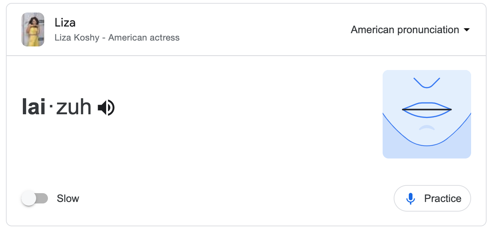

Hello and kia ora!

I'm a statistics enthusiast and educator in Tāmaki Makaurau \| Auckland, Aotearoa \| New Zealand.

### CV at a glance:

-   👩🏻‍🏫 Professional Teaching Fellow in the Department of Statistics at the University of Auckland (2023-)

-   👩🏻‍🏫 Assistant Professor, Teaching Stream in the Department of Statistical Sciences at the University of Toronto (2020-2023)

-   💼 Statistical consultant for a range of business, education and not for-profit organisations, (or as I prefer, Data Ambassador), self-employed (2013-2019)

-   🎓 PhD in Statistics from the University of Auckland (2015-2022): [*Longitudinal predictors of mortality inequalities in Aotearoa New Zealand*](https://researchspace.auckland.ac.nz/handle/2292/67251)

My statistics education interests include: teaching and assessing ethical professional practice and writing for statisticians, online learning, supporting student mental health, building undergraduate student community, large classroom teaching and innovative assessments.

My background is in understanding how people's social and economic experiences relate to risk of death in Aotearoa New Zealand, using methods appropriate for longitudinally linked census data. I also used to run a small consulting company, the Data Embassy, working with a range of business, education and not-for-profit clients.

I grew up between Canada and New Zealand and so sometimes my slang is confusing. But don't worry, *she'll be right, eh?*

#### Do you have to talk *to* or *about* me for some reason? Here are some things that might be useful to know:

-   What are my **pronouns**? [she/her/hers](https://www.mypronouns.org/she-her)

-   How should you introduce me for a talk or address emails to me? I honestly prefer just 'Liza'.

-   How do you **pronounce** my name?

    -   Google's pronunciation for Liza Koshy is the same as mine. Or here is a whole song about being a [Liza with a Z](https://www.youtube.com/watch?v=rFATpUrtREU). 🎵

    {.external width="80%"}

    -   My last name is Bolton (**bowl**·tn), and the pronunciation Google provides is correct for that, too.

<a rel="me" href="https://mas.to/@lizabolton">.</a>
