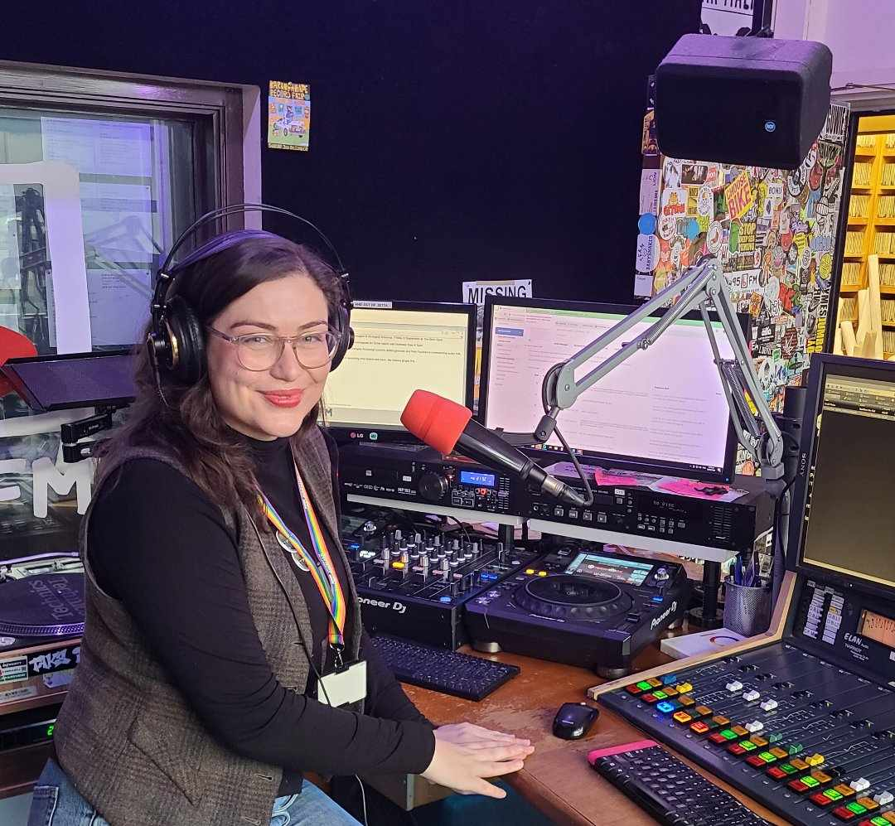

## 🤔 That’s questionable: Designing and deploying effective models for generating multiple versions of auto-marked questions

*2024-12-02*

This is joint work with Anna Fergusson, Lars Thomsen, Charlotte Jones-Todd

### Abstract
Creating automatically marked question banks with a number of versions is popular for both supporting academic integrity and for providing low-stakes assessment opportunities with instant feedback. Short quizzes can engage students in checking their understanding throughout a course and support their preparation for higher-stakes assessments. While auto-marking can help reduce teaching team workload, the creation and maintenance of high-quality and fair question banks can be very demanding. To support this, a range of computational tools exist for creating auto-marked questions and deploying them to assessment platforms (e.g., the R package exams, Grün & Zeileis, 2009). However, while there is guidance for the practical implementation of these tools (e.g., Zeileis et al., 2014), there is very little documentation that explains the design process for developing models that can generate tens or even hundreds of versions of questions. This talk has three aims:
1) to explore design principles that support pedagogy-first approaches to creating question-generating models,
2) to share considerations and opportunities with respect to having students analyse data (with iNZight Lite) to answer quiz questions, and
3) to report on how students are actually using quizzes with multiple versions in a large introductory statistics course, including findings based on data about quiz attempts, as well as reflections from the teaching team.

### Slides

Direct link: <https://lizabolton.github.io/2024-12-02_NZSA-Wellington/#/title-slide>

```{r, echo=FALSE}
xaringanExtra::embed_xaringan(
  url = "https://lizabolton.github.io/2024-12-02_NZSA-Wellington/#/title-slide",
  ratio = "16:9"
)
```

## *This way or data-way: A survival guide for a world of data*, Raising the Bar Auckland

*2024-08-27*

Blurb: What do motivational posts on LinkedIn have in common with the supposedly small feet of Victorians? Join Dr Liza Bolton as she explores the habits of statistical thinking that can make our day-to-day lives better – from picking a restaurant like a statistician, to why you shouldn’t necessarily believe a bus stop advertisement when it tells you your hometown is one of New Zealand’s most monogamous. There are no mathematics prerequisites here – number lovers and loathers alike are invited on a romp through the good, the bad and the ugly from a world full of data and decisions.

Recorded at [Norma Taps](https://normataps.co.nz/), Auckland.

You can find the [annotated bibliography for this talk on my blog](https://blog.lizabolton.com/posts/2024-08-27-raising-the-bar-annotated-bibliography/).

### Listen [54:07]

Listen on [SoundCloud](https://soundcloud.com/university-of-auckland/this-way-or-data-way-a?in=university-of-auckland/sets/raising-the-bar-auckland-2024&si=3abe747c6c004219844db13d685ae1d7) or [Spotify](https://open.spotify.com/episode/1tmaaDYd0dUyXPBPykxqsd).

## *Ready Steady Learn*, 95bFM

*2024-08-20*

I dropped into the studio for a quick [Ready Steady Learn](https://feeds.95bfm.com/bfmreadysteadylearn) chat with host Jonny in the lead up to the [Raising the Bar](https://www.rtbevent.com/auckland-24) on August 27.

{fig-alt="Liza, a pale skinned brunette, sitting at the radio studio desk with lots of audio equipment around."}

### Listen [9:30]

Direct link: https://95bfm.com/bcast/ready-steady-learn-w-liza-bolton-august-20-2024

## *Lies, Damned Lies and Statistics*, Smooth Brain Society

*2024-05-16*

Host: [Dr Sahir Hussain](https://www.linkedin.com/in/sahir-hussain-b7a224190/) 

Cohost: [Alex Marinkovich-Josey](https://www.linkedin.com/in/alex-marinkovich-josey/)

### Description

The use of stats and throwing around numbers in conversation is incredibly common, yet statistics itself is poorly understood. Dr. Liza Bolton from  @universityofauckland discusses the dark art that is statistics. Using examples, she takes us through some misconceptions and dispels the notion that numbers don’t lie. We cover how to identify the best ice cream store, how to not be fooled when stats are mischaracterized in media and politics, why we worship the nat 20 dice roll and is the 27 club for musicians a real thing?

### Watch or listen [1:10:19]

<iframe width="560" height="315" src="https://www.youtube.com/embed/KS2pOAnq1bQ?si=v4esy3_2D-HFIyjk" title="YouTube video player" frameborder="0" allow="accelerometer; autoplay; clipboard-write; encrypted-media; gyroscope; picture-in-picture; web-share" referrerpolicy="strict-origin-when-cross-origin" allowfullscreen></iframe>

This episode is available where ever you get your podcasts.

- [On the Smooth Brain Society website.](https://smoothbrainsociety.com/2024/05/16/37-lies-damned-lies-and-statistics-dr-liza-bolton/)
- Also available on [Wellington Access Radio.](https://accessradio.org.nz/shows-podcasts/smooth-brain-society/)

## *~~Dance like nobody’s watching~~🕺<br>Write like nobody’s reading? ✍️:<br>Low-stakes writing, academic reflection & graduate profile capabilities*, Faculty of Science Early Career Research Group Workshop

*2024-04-10*

The Early Career Research Group supports Research Fellows in the Faculty of Science. Many Research Fellows also teach and the team organises this workshop yearly to support people to engage with education research and effective practices.

### Slides

Direct link: <https://lizabolton.github.io/2024-Lowstakes-writing-ECR/#/title-slide>

```{r, echo=FALSE}
xaringanExtra::embed_xaringan(
  url = "https://lizabolton.github.io/2024-Lowstakes-writing-ECR/#/title-slide",
  ratio = "16:9"
)
```

## *Are we a-head or not? Use and misuse of per capita measures*, Science Media Centre

*2024-03-20*

Read the comment on [SCIMEX](https://www.scimex.org/newsfeed/per-capita-needs-to-go-say-researchers).

This is a short 'expert reaction' solicited by the Science Media Centre (NZ) on an published article about issues with, and an alternative to, reporting *per capita* measures. Thomas Lumley also commented, and his thoughts are always a good read!

## Data Aotearoa workshop for data journos

*2024-03-08*

Direct link: <https://lizabolton.github.io/data-aotearoa-2024/>

```{r, echo=FALSE}
xaringanExtra::embed_xaringan(
  url = "https://lizabolton.github.io/data-aotearoa-2024/#/title-slide",
  ratio = "16:9"
)
```

## Data democratisation panel, Science Communicators Association of New Zealand 

*2023-11-17*

**Facilitator**: Dacia Herbulock 

**Panellists**: Keith Ng, Karatiana Taiuru, Liza Bolton

[2023 Science Communicators Association of New Zealand Conference: *Techtopia: Navigating the power, potential and perils of technology in science communication*](https://www.scanz.co.nz/2023-conference) in Te Whanganui-a-Tara Wellington, Aotearoa New Zealand

Watch the video on [YouTube](https://www.youtube.com/watch?v=8cBOIyoISbY&list=FLaNRURNtIY08GxfUJz0PVaQ).

See post with resources and links [here](https://blog.lizabolton.com/posts/2023-11-15-scanz/).


## `learnr` *Interactives or: How I Learned to Stop Worrying and Turn my Students into Pixelated Farmers*, Computation and Data Science Education Community of Practice

*2022-02-04*

See the blog post [here](https://blog.lizabolton.com/posts/2022-02-04-learnr-interactives-or-how-i-learned-to-stop-worrying-and-turn-my-students-into-pixelated-farmers/) for more

### Slides

Direct link: <https://bolton-cds-w22.netlify.app/#1>

```{r, echo=FALSE}
xaringanExtra::embed_xaringan(
  url = "https://bolton-cds-w22.netlify.app/",
  ratio = "16:9"
)
```

## *Panel on teaching data-focused topics*, Toronto Data Workshop

*2020-12-17*

Big thank you to [Rohan Alexander](https://rohanalexander.com/) for organising this panel on teaching data-focussed topics. This was one of my favourite talks I've ever done because I got to get creative with it. Unfortunately my use of music kept getting Rohan copyright stuck on YouTube. Sorry, Rohan!

<iframe width="560" height="450" src="https://www.youtube.com/embed/c3R6pZisvm0?start=894" allowfullscreen>

</iframe>

My bit starts at 14:51 but I'd highly recommend the other speakers' sections!

#### Fellow panellists:

-   [Nathalie Moon, Univeristy of Toronto](https://www.statistics.utoronto.ca/people/directories/all-faculty/nathalie-moon)
-   [Maria Tackett, Duke University](https://www.mariatackett.net/)
-   [Teon Brooks, Mozilla Firefox](https://teonbrooks.com/)

## *Everything you need to fall in love with Statistics*, an interview with [storyo.co](https://www.storyo.co/)

*2019-07-11*

> I met Liza (pronounced Lie-zuh, like Liza Minnelli) at the R-Ladies meetup in Auckland, New Zealand where she was giving a talk on colour palettes. If you ever meet Liza, you will see that it is absolutely impossible to not get a massive positive energy recharge after talking to her. Liza is currently doing her PhD in Statistics, running a consultancy called The Data Embassy, speaking at events, teaching, mentoring. It would be my absolute pleasure to learn more about Liza and share her wonderful story.

[Read the full interview here](https://www.storyo.co/stories/liza-bolton)

## *Don't cha wish your ggplot had colours like me?*, R Ladies Auckland

*2019-06-12*

A lightning talk about using colour when plotting data with `ggplot`.

```{r, echo=FALSE}
xaringanExtra::embed_xaringan(url = "https://www.dataembassy.co.nz/Liza-colours-in-R#1", ratio = "16:9")
```

## _Lotto...you're doing it wrong!_, an interview with The Project NZ

_2018-09-21_

> After hearing that FORTY Kiwis won Lotto first division this week we thought... what are the chances of that?!
>
> So we invited statistician, Liza Bolton, onto the show to tell us her top 5 tips for winning at Lotto AKA... you're doing it wrong!


[~~Watch on Facebook (\~4 mins)~~](https://www.facebook.com/TheProjectNZ/videos/2233885323501095/)
Unfortunately this video disappeared with The Project NZ.

## *The Cambridge Analytica fallout*, an interview with RNZ

*2018-03-21*

> Social media giant Facebook is having a rough week, it's stocks plummeting and a "please explain" from congress following reports a political consulting firm kept data on millions of its users.
>
> The Cambridge Analytica files have caused a huge fallout, its CEO now suspended, after a UK newspaper revealed the company used underhanded tricks to sway election campaigns.
>
> It's a complicated investigation so here to explain why it's causing so much concern is Liza Bolton, from the Statistics department at the University of Auckland.

[Listen here (\~11 minutes)](https://www.rnz.co.nz/national/programmes/afternoons/audio/2018637066/the-cambridge-analytica-fallout)
